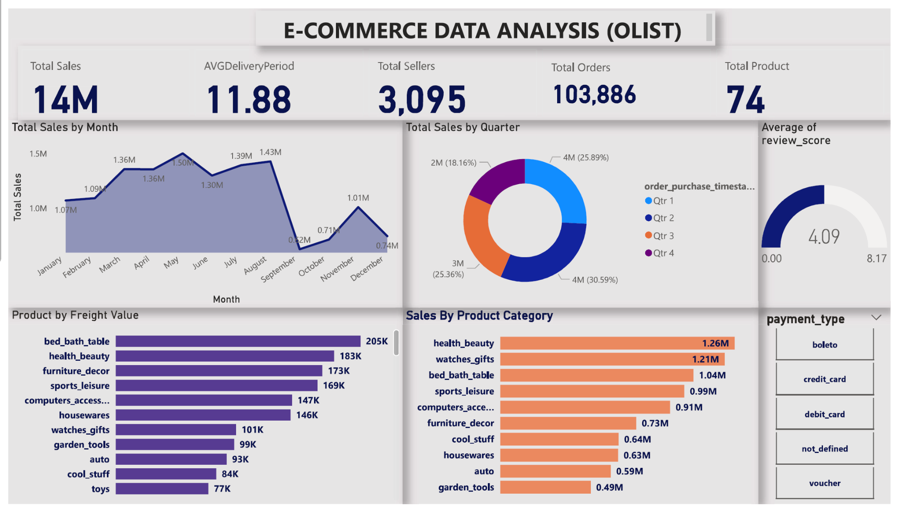

# 🛒 E-Commerce Data Analysis Dashboard (Olist)

## 📘 Overview

This interactive Power BI dashboard presents a detailed analysis of the **Olist E-Commerce dataset**, offering insights into sales performance, delivery times, customer satisfaction, product distribution, and seller activity. It is designed for business analysts, e-commerce managers, and stakeholders to monitor key metrics and trends that influence decision-making.

---

## 📊 Key Metrics

* **Total Sales**: 14 million units
* **Average Delivery Period**: 11.88 days
* **Total Sellers**: 3,095
* **Total Orders**: 103,886
* **Total Product Categories**: 74
* **Average Review Score**: 4.09 / 5

---

## 🧩 Visual Components

### 📈 Total Sales by Month

* Tracks monthly performance with a notable peak in **May (1.50M)** and drops in **September (0.2M)**.

### 📆 Total Sales by Quarter

* **Q2 and Q4** drive the most sales, each contributing over 25%.

### 📦 Product by Freight Value

* Shows shipping cost intensity across categories.

  * **Top 3 Freight-Intensive Products**:

    * Bed Bath Table (205K)
    * Health Beauty (183K)
    * Furniture Decor (173K)

### 🛍️ Sales by Product Category

* **Top Categories by Sales Volume**:

  * Health Beauty (1.26M)
  * Watches Gifts (1.21M)
  * Bed Bath Table (1.04M)

### 💳 Payment Type Filter

* Allows filtering by various payment methods: boleto, credit card, debit card, voucher, etc.

### 📊 Customer Satisfaction

* The average review score is **4.09**, indicating high customer satisfaction.

---

## 🔍 Use Cases

* **Inventory Strategy**: Identify high freight or high-selling items to optimize logistics.
* **Marketing Focus**: Target top product categories for promotions.
* **Operational Improvement**: Monitor delivery performance trends and review scores.
* **Payment Preference Analysis**: Examine buyer payment behavior for optimization.

---

## 🛠️ Built With

* **Power BI**: Interactive dashboard design and data visualization.
* **Olist Dataset**: Publicly available dataset for Brazil's e-commerce market.

---

## 📁 Image File

